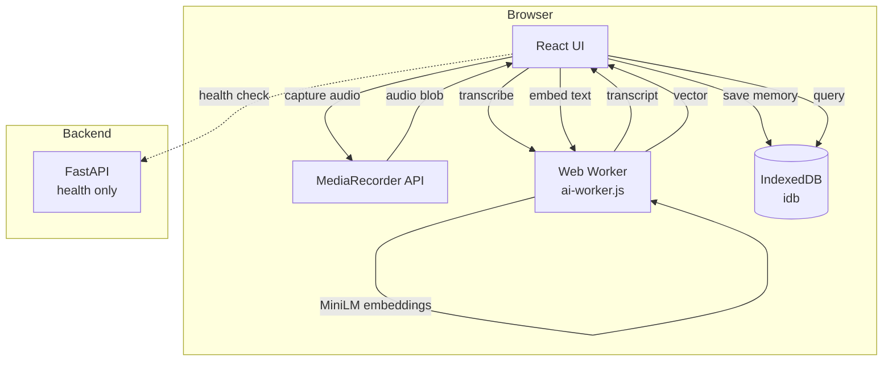
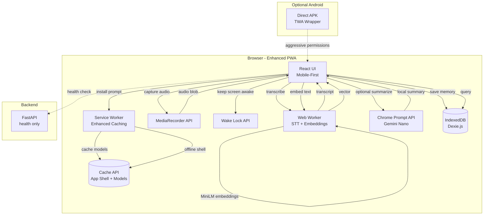
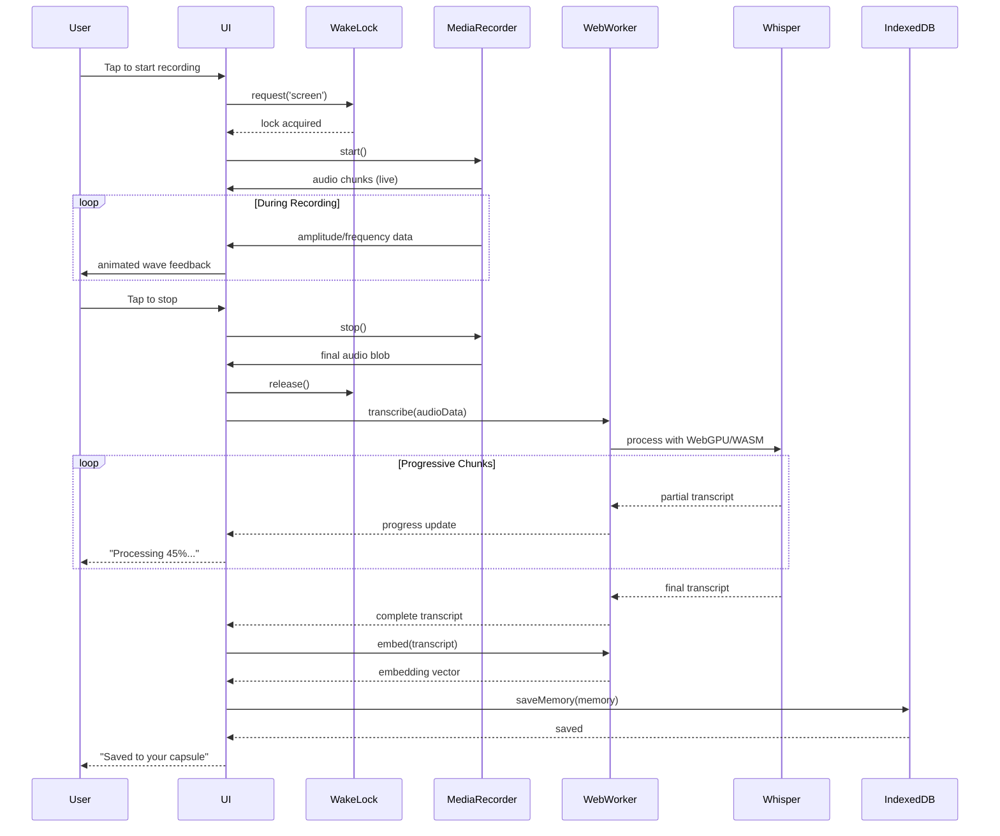

# Design Document: Client-Side STT PWA Enhancement

## Overview

This design enhances the existing Memory Capsule PWA with production-grade PWA capabilities, optimized client-side speech-to-text inference, background recording workarounds for mobile browsers, and optional Chrome Prompt API integration for local summarization. The goal is to create a zero-cost, privacy-first voice memory app that avoids app store fees while delivering native-like experiences through browser APIs. The architecture maintains the existing local-first philosophy: all audio processing, transcription, and storage happen on-device with no server dependencies for core functionality.

The enhancement focuses on four key areas: (1) Full PWA optimization for home screen installation and offline capabilities, (2) Performance-optimized Whisper inference using quantized models and WebGPU acceleration, (3) Mobile browser background recording workarounds using Wake Lock API and Web Workers, and (4) Optional Gemini Nano integration via Chrome Prompt API for enhanced local summarization.

## Architecture

### Current Architecture (Baseline)



### Enhanced Architecture (Target)



### Key Architectural Changes

1. **Enhanced Service Worker**: Upgrade from basic shell caching to intelligent model caching, offline-first strategies, and background sync preparation
2. **Wake Lock Integration**: Prevent screen sleep during active recording sessions on mobile browsers
3. **Optimized Web Worker**: Add WebGPU detection, progressive loading feedback, and model warm-up strategies
4. **Chrome Prompt API**: Optional Gemini Nano integration for enhanced local summarization without cloud costs
5. **IndexedDB Migration**: Transition from raw `idb` to Dexie.js for better schema management and query capabilities
6. **PWA Manifest Enhancement**: Add shortcuts, screenshots, categories, and install promotion strategies
7. **Optional TWA/APK**: Provide direct APK download for Android power users requiring aggressive background permissions

## Main Recording & Transcription Flow



## Components and Interfaces

### Component 1: Enhanced Service Worker

**Purpose**: Provide offline-first app shell, cache AI models, handle install prompts, and prepare for background sync

**Interface**:
```javascript
// Service Worker Lifecycle Events
self.addEventListener('install', (event) => {
  event.waitUntil(cacheAppShell());
});

self.addEventListener('activate', (event) => {
  event.waitUntil(cleanupOldCaches());
});

self.addEventListener('fetch', (event) => {
  event.respondWith(handleFetch(event.request));
});

// Install prompt handling
self.addEventListener('beforeinstallprompt', (event) => {
  event.preventDefault();
  return event;
});
```

**Responsibilities**:
- Cache app shell (HTML, CSS, JS, icons) for offline access
- Cache AI model files from CDN for faster subsequent loads
- Implement cache-first strategy for static assets
- Implement network-first strategy for API calls
- Handle offline fallbacks gracefully
- Prepare for future background sync capabilities
- Manage cache versioning and cleanup

### Component 2: Wake Lock Manager

**Purpose**: Prevent screen sleep during active recording sessions on mobile browsers

**Interface**:
```javascript
class WakeLockManager {
  constructor();
  
  // Request wake lock when recording starts
  async requestWakeLock(): Promise<boolean>;
  
  // Release wake lock when recording stops
  async releaseWakeLock(): Promise<void>;
  
  // Check if Wake Lock API is supported
  isSupported(): boolean;
  
  // Get current lock status
  isLocked(): boolean;
  
  // Handle visibility change (re-acquire lock if needed)
  handleVisibilityChange(): Promise<void>;
}
```

**Responsibilities**:
- Request screen wake lock when recording begins
- Release wake lock when recording completes or errors
- Handle page visibility changes (re-acquire lock when page becomes visible)
- Provide fallback behavior for unsupported browsers
- Track lock state and provide status to UI
- Handle wake lock errors gracefully

### Component 3: Enhanced AI Worker

**Purpose**: Perform client-side transcription and embedding with optimized performance and progressive feedback

**Interface**:
```javascript
// Worker Message Types
interface WorkerMessage {
  id: string;
  type: 'WARMUP' | 'TRANSCRIBE' | 'EMBED' | 'STATUS';
  payload?: {
    audioData?: Float32Array;
    text?: string;
    progress?: number;
  };
}

interface WorkerResponse {
  id: string;
  type: 'success' | 'error' | 'progress';
  payload?: {
    text?: string;
    embedding?: number[];
    progress?: number;
    stage?: string;
  };
  error?: string;
}

// Worker API
self.onmessage = async (event: MessageEvent<WorkerMessage>) => {
  // Handle WARMUP, TRANSCRIBE, EMBED messages
};
```

**Responsibilities**:
- Load and initialize Whisper model (whisper-base with q8 quantization)
- Load and initialize MiniLM embedding model
- Detect and use WebGPU when available, fallback to WASM
- Provide progressive transcription feedback (chunk-by-chunk)
- Handle model caching and warm-up strategies
- Emit status updates for UI feedback
- Handle errors and provide meaningful error messages
- Support model switching (tiny vs base) based on device capabilities

### Component 4: Chrome Prompt API Integration

**Purpose**: Provide optional local summarization using Gemini Nano without cloud costs

**Interface**:
```javascript
class PromptAPIClient {
  constructor();
  
  // Check if Prompt API is available
  async isAvailable(): Promise<boolean>;
  
  // Initialize the API session
  async initialize(): Promise<void>;
  
  // Generate summary from transcript
  async summarize(transcript: string, options?: SummaryOptions): Promise<string>;
  
  // Generate tags from transcript
  async generateTags(transcript: string): Promise<string[]>;
  
  // Detect emotion from transcript
  async detectEmotion(transcript: string): Promise<string>;
  
  // Cleanup session
  async destroy(): Promise<void>;
}

interface SummaryOptions {
  maxLength?: number;
  style?: 'concise' | 'detailed' | 'bullet-points';
}
```

**Responsibilities**:
- Detect Chrome Prompt API availability
- Initialize Gemini Nano session
- Generate enhanced summaries from transcripts
- Generate contextual tags
- Detect emotional tone
- Handle API errors and fallback to rule-based methods
- Manage session lifecycle
- Provide opt-in/opt-out preference handling


### Component 5: Enhanced IndexedDB Layer (Dexie.js)

**Purpose**: Provide structured schema management, better query capabilities, and migration support

**Interface**:
```javascript
import Dexie from 'dexie';

class MemoryCapsuleDB extends Dexie {
  memories: Dexie.Table<Memory, string>;
  preferences: Dexie.Table<Preference, string>;
  
  constructor() {
    super('memory-capsule-db');
    
    this.version(2).stores({
      memories: 'id, createdAt, emotion, *tags, durationMs',
      preferences: 'key'
    });
  }
}

interface Memory {
  id: string;
  transcript: string;
  summary: string;
  tags: string[];
  emotion: string;
  embedding: number[];
  audioBlob: Blob;
  createdAt: string;
  durationMs: number;
  averageAmplitude: number;
  frequency: number;
}

interface Preference {
  key: string;
  value: any;
}

// Database API
const db = new MemoryCapsuleDB();

// Query methods
async function getMemories(filters?: MemoryFilters): Promise<Memory[]>;
async function saveMemory(memory: Memory): Promise<string>;
async function deleteMemory(id: string): Promise<void>;
async function searchMemoriesByTag(tag: string): Promise<Memory[]>;
async function getMemoriesByDateRange(start: Date, end: Date): Promise<Memory[]>;
```

**Responsibilities**:
- Define structured schema with indexes
- Handle database migrations from v1 (idb) to v2 (Dexie)
- Provide type-safe query methods
- Support compound queries (date range + emotion + tags)
- Handle blob storage efficiently
- Provide transaction support
- Export/import capabilities for backup
- Handle database errors and corruption recovery

### Component 6: PWA Install Manager

**Purpose**: Handle PWA installation flow, prompts, and user education

**Interface**:
```javascript
class PWAInstallManager {
  constructor();
  
  // Capture beforeinstallprompt event
  captureInstallPrompt(event: BeforeInstallPromptEvent): void;
  
  // Show install prompt to user
  async showInstallPrompt(): Promise<'accepted' | 'dismissed'>;
  
  // Check if app is already installed
  isInstalled(): boolean;
  
  // Check if install prompt is available
  canPromptInstall(): boolean;
  
  // Track install analytics
  trackInstallEvent(event: 'prompted' | 'accepted' | 'dismissed'): void;
  
  // Get platform-specific install instructions
  getInstallInstructions(): InstallInstructions;
}

interface InstallInstructions {
  platform: 'ios' | 'android' | 'desktop';
  steps: string[];
  canAutoPrompt: boolean;
}
```

**Responsibilities**:
- Capture and store beforeinstallprompt event
- Show install prompt at appropriate times (not immediately)
- Provide platform-specific install instructions (iOS Safari, Android Chrome, Desktop)
- Track install funnel metrics
- Handle install success/failure
- Show post-install onboarding
- Respect user dismissal preferences


## Data Models

### Memory Model (Enhanced)

```javascript
interface Memory {
  // Core identification
  id: string;                    // UUID v4
  createdAt: string;             // ISO 8601 timestamp
  
  // Audio data
  audioBlob: Blob;               // Original audio recording
  durationMs: number;            // Recording duration in milliseconds
  averageAmplitude: number;      // Average amplitude (0-1)
  frequency: number;             // Average frequency (0-1)
  
  // Transcription
  transcript: string;            // Full transcript from Whisper
  transcriptionModel: string;    // Model used (e.g., "whisper-base-q8")
  transcriptionDuration: number; // Time taken to transcribe (ms)
  
  // Semantic understanding
  summary: string;               // Summary (rule-based or Gemini Nano)
  summarySource: 'rule-based' | 'gemini-nano'; // How summary was generated
  tags: string[];                // Extracted tags
  emotion: string;               // Detected emotion
  
  // Search
  embedding: number[];           // 384-dim vector from MiniLM
  
  // Metadata
  version: number;               // Schema version for migrations
  deviceInfo?: {                 // Optional device context
    userAgent: string;
    platform: string;
  };
}
```

**Validation Rules**:
- `id` must be valid UUID v4
- `createdAt` must be valid ISO 8601 timestamp
- `transcript` must be non-empty string
- `embedding` must be array of 384 numbers
- `durationMs` must be positive integer
- `tags` must be array of 1-10 strings
- `emotion` must be one of: 'neutral', 'happy', 'sad', 'anxious', 'excited', 'reflective'

### Preference Model

```javascript
interface Preferences {
  // Display preferences
  gentleMode: boolean;           // Softer animations and transitions
  summariesFirst: boolean;       // Show summaries before transcripts
  captureReminders: boolean;     // Show periodic capture prompts
  
  // PWA preferences
  installPromptDismissed: boolean;
  installPromptDismissedAt?: string;
  
  // AI preferences
  useGeminiNano: boolean;        // Use Chrome Prompt API if available
  transcriptionModel: 'whisper-tiny' | 'whisper-base';
  
  // Privacy preferences
  analyticsEnabled: boolean;
  
  // Performance preferences
  useWebGPU: boolean;            // Use WebGPU if available
  autoWarmupModels: boolean;     // Warm up models on app load
  
  // Notification preferences (future)
  notificationsEnabled: boolean;
  dailyReminderTime?: string;    // HH:MM format
}
```

**Validation Rules**:
- All boolean fields default to `false` except `autoWarmupModels` (true)
- `transcriptionModel` defaults to 'whisper-tiny'
- `installPromptDismissedAt` must be valid ISO 8601 if present
- `dailyReminderTime` must match HH:MM format if present

### PWA Manifest Model (Enhanced)

```javascript
interface PWAManifest {
  short_name: string;
  name: string;
  description: string;
  start_url: string;
  display: 'standalone' | 'fullscreen' | 'minimal-ui';
  background_color: string;
  theme_color: string;
  orientation?: 'portrait' | 'landscape' | 'any';
  
  icons: Array<{
    src: string;
    sizes: string;
    type: string;
    purpose?: 'any' | 'maskable' | 'monochrome';
  }>;
  
  screenshots?: Array<{
    src: string;
    sizes: string;
    type: string;
    platform?: 'narrow' | 'wide';
    label?: string;
  }>;
  
  shortcuts?: Array<{
    name: string;
    short_name?: string;
    description?: string;
    url: string;
    icons?: Array<{
      src: string;
      sizes: string;
    }>;
  }>;
  
  categories?: string[];
  iarc_rating_id?: string;
  related_applications?: Array<{
    platform: string;
    url: string;
    id?: string;
  }>;
}
```

**Enhanced Manifest Example**:
```json
{
  "short_name": "Memory Capsule",
  "name": "Memory Capsule - Private Voice Memory Journal",
  "description": "Capture and revisit voice memories with private, on-device transcription and search. No cloud, no tracking.",
  "start_url": "/",
  "display": "standalone",
  "background_color": "#FDFBF7",
  "theme_color": "#FDFBF7",
  "orientation": "portrait",
  "categories": ["productivity", "lifestyle", "health"],
  "icons": [
    {
      "src": "/icon-192.png",
      "sizes": "192x192",
      "type": "image/png",
      "purpose": "any"
    },
    {
      "src": "/icon-512.png",
      "sizes": "512x512",
      "type": "image/png",
      "purpose": "any"
    },
    {
      "src": "/icon-maskable.png",
      "sizes": "512x512",
      "type": "image/png",
      "purpose": "maskable"
    }
  ],
  "screenshots": [
    {
      "src": "/screenshots/home.png",
      "sizes": "1170x2532",
      "type": "image/png",
      "platform": "narrow",
      "label": "Voice capture with animated wave"
    },
    {
      "src": "/screenshots/memories.png",
      "sizes": "1170x2532",
      "type": "image/png",
      "platform": "narrow",
      "label": "Memory library with search"
    }
  ],
  "shortcuts": [
    {
      "name": "New Memory",
      "short_name": "Record",
      "description": "Start recording a new memory",
      "url": "/?action=record",
      "icons": [
        {
          "src": "/icons/mic.png",
          "sizes": "96x96"
        }
      ]
    },
    {
      "name": "Search Memories",
      "short_name": "Search",
      "description": "Search your saved memories",
      "url": "/memories?action=search",
      "icons": [
        {
          "src": "/icons/search.png",
          "sizes": "96x96"
        }
      ]
    }
  ]
}
```


## Algorithmic Pseudocode

### Main Recording Algorithm with Wake Lock

```javascript
async function startRecordingWithWakeLock() {
  // INPUT: User tap/click to start recording
  // OUTPUT: Recording session with wake lock active
  // PRECONDITION: MediaRecorder and Wake Lock API available
  // POSTCONDITION: Recording active, screen stays awake
  
  try {
    // Step 1: Request wake lock
    if ('wakeLock' in navigator) {
      wakeLock = await navigator.wakeLock.request('screen');
      console.log('Wake lock acquired');
      
      // Handle wake lock release on visibility change
      wakeLock.addEventListener('release', () => {
        console.log('Wake lock released');
      });
    }
    
    // Step 2: Request microphone access
    const stream = await navigator.mediaDevices.getUserMedia({ audio: true });
    
    // Step 3: Set up audio analysis
    const audioContext = new AudioContext();
    const analyser = audioContext.createAnalyser();
    analyser.fftSize = 256;
    analyser.smoothingTimeConstant = 0.85;
    
    const source = audioContext.createMediaStreamSource(stream);
    source.connect(analyser);
    
    // Step 4: Start MediaRecorder
    const recorder = new MediaRecorder(stream, {
      mimeType: 'audio/webm;codecs=opus'
    });
    
    const chunks = [];
    recorder.ondataavailable = (event) => {
      if (event.data.size > 0) {
        chunks.push(event.data);
      }
    };
    
    recorder.onstop = async () => {
      // Release wake lock when recording stops
      if (wakeLock) {
        await wakeLock.release();
      }
      
      // Process recording
      const blob = new Blob(chunks, { type: 'audio/webm' });
      await processRecording(blob);
    };
    
    recorder.start();
    
    // Step 5: Start amplitude monitoring
    monitorAudioLevels(analyser);
    
  } catch (error) {
    // Release wake lock on error
    if (wakeLock) {
      await wakeLock.release();
    }
    throw error;
  }
}
```

**Preconditions**:
- Browser supports MediaRecorder API
- Browser supports Wake Lock API (optional, graceful degradation)
- User has granted microphone permissions
- Audio context is available

**Postconditions**:
- Recording is active
- Wake lock is acquired (if supported)
- Audio levels are being monitored
- UI shows recording state

**Loop Invariants**:
- Wake lock remains active while recording
- Audio chunks are continuously collected
- Amplitude data is continuously updated

### Progressive Transcription Algorithm

```javascript
async function transcribeWithProgress(audioData) {
  // INPUT: Float32Array audio data
  // OUTPUT: Transcript string with progressive updates
  // PRECONDITION: Whisper model loaded in worker
  // POSTCONDITION: Complete transcript returned, progress events emitted
  
  const CHUNK_LENGTH_S = 20;
  const STRIDE_LENGTH_S = 4;
  
  // Step 1: Send transcription request to worker
  const requestId = generateUUID();
  const progressCallback = (progress) => {
    // Emit progress event to UI
    emitProgressEvent({
      stage: 'transcribing',
      progress: progress.percent,
      partialText: progress.text
    });
  };
  
  // Step 2: Worker processes audio in chunks
  worker.postMessage({
    id: requestId,
    type: 'TRANSCRIBE',
    payload: {
      audioData: audioData,
      options: {
        chunk_length_s: CHUNK_LENGTH_S,
        stride_length_s: STRIDE_LENGTH_S,
        return_timestamps: false,
        language: 'en',
        task: 'transcribe'
      }
    }
  });
  
  // Step 3: Listen for progress and completion
  return new Promise((resolve, reject) => {
    const handler = (event) => {
      if (event.data.id !== requestId) return;
      
      if (event.data.type === 'progress') {
        progressCallback(event.data.payload);
      } else if (event.data.type === 'success') {
        worker.removeEventListener('message', handler);
        resolve(event.data.payload.text);
      } else if (event.data.type === 'error') {
        worker.removeEventListener('message', handler);
        reject(new Error(event.data.error));
      }
    };
    
    worker.addEventListener('message', handler);
  });
}
```

**Preconditions**:
- `audioData` is valid Float32Array
- Whisper model is loaded in worker
- Worker is responsive

**Postconditions**:
- Returns complete transcript string
- Progress events emitted during processing
- Worker remains available for next request

**Loop Invariants**:
- Each chunk is processed sequentially
- Progress percentage increases monotonically
- Partial transcripts accumulate correctly

### WebGPU Detection and Fallback Algorithm

```javascript
async function initializeWhisperWithOptimalBackend() {
  // INPUT: None
  // OUTPUT: Initialized Whisper pipeline with best available backend
  // PRECONDITION: Transformers.js library loaded
  // POSTCONDITION: Whisper pipeline ready with WebGPU or WASM
  
  let device = 'wasm';
  let dtype = 'q8';
  
  // Step 1: Detect WebGPU support
  if ('gpu' in navigator) {
    try {
      const adapter = await navigator.gpu.requestAdapter();
      if (adapter) {
        device = 'webgpu';
        dtype = 'fp16'; // Use higher precision with WebGPU
        console.log('WebGPU available, using GPU acceleration');
      }
    } catch (error) {
      console.log('WebGPU detection failed, falling back to WASM');
    }
  }
  
  // Step 2: Select model based on device capabilities
  const modelName = device === 'webgpu' 
    ? 'Xenova/whisper-base'      // Larger model for GPU
    : 'Xenova/whisper-tiny';     // Smaller model for CPU
  
  // Step 3: Initialize pipeline with optimal settings
  const pipeline = await createPipeline('automatic-speech-recognition', modelName, {
    device: device,
    dtype: dtype,
    progress_callback: (progress) => {
      emitStatusUpdate({
        stage: 'loading-transcriber',
        progress: progress.progress,
        file: progress.file
      });
    }
  });
  
  return {
    pipeline,
    device,
    modelName
  };
}
```

**Preconditions**:
- Transformers.js library is loaded
- Browser supports either WebGPU or WASM

**Postconditions**:
- Whisper pipeline is initialized
- Optimal backend (WebGPU or WASM) is selected
- Model is cached for future use

**Loop Invariants**: N/A (no loops)


### Chrome Prompt API Integration Algorithm

```javascript
async function summarizeWithGeminiNano(transcript) {
  // INPUT: Transcript string
  // OUTPUT: Enhanced summary string
  // PRECONDITION: Chrome Prompt API available, user opted in
  // POSTCONDITION: Summary generated or fallback to rule-based
  
  try {
    // Step 1: Check API availability
    if (!('ai' in window) || !window.ai.languageModel) {
      throw new Error('Prompt API not available');
    }
    
    // Step 2: Check model availability
    const capabilities = await window.ai.languageModel.capabilities();
    if (capabilities.available === 'no') {
      throw new Error('Gemini Nano not available');
    }
    
    // Step 3: Create session
    const session = await window.ai.languageModel.create({
      temperature: 0.7,
      topK: 3
    });
    
    // Step 4: Generate summary with prompt
    const prompt = `Summarize this voice memory in 1-2 concise sentences. Focus on the key point or emotion:

"${transcript}"

Summary:`;
    
    const summary = await session.prompt(prompt);
    
    // Step 5: Cleanup
    session.destroy();
    
    return {
      summary: summary.trim(),
      source: 'gemini-nano'
    };
    
  } catch (error) {
    console.log('Gemini Nano failed, using rule-based summary:', error);
    
    // Fallback to rule-based summarization
    return {
      summary: generateRuleBasedSummary(transcript),
      source: 'rule-based'
    };
  }
}

function generateRuleBasedSummary(transcript) {
  // Simple rule-based fallback
  const sentences = transcript.split(/[.!?]+/).filter(s => s.trim());
  
  if (sentences.length === 0) return transcript;
  if (sentences.length === 1) return sentences[0].trim();
  
  // Return first sentence if it's substantial
  const firstSentence = sentences[0].trim();
  if (firstSentence.split(' ').length >= 5) {
    return firstSentence;
  }
  
  // Otherwise return first two sentences
  return sentences.slice(0, 2).join('. ').trim() + '.';
}
```

**Preconditions**:
- `transcript` is non-empty string
- Chrome Prompt API may or may not be available
- User has opted in to use Gemini Nano

**Postconditions**:
- Returns summary object with source indicator
- Always returns a summary (fallback to rule-based)
- Session is properly cleaned up

**Loop Invariants**: N/A (no loops)

### Service Worker Model Caching Algorithm

```javascript
async function cacheAIModels() {
  // INPUT: None
  // OUTPUT: AI model files cached for offline use
  // PRECONDITION: Service worker active, Cache API available
  // POSTCONDITION: Model files cached, faster subsequent loads
  
  const MODEL_CACHE_NAME = 'memory-capsule-models-v1';
  
  // Step 1: Open model cache
  const cache = await caches.open(MODEL_CACHE_NAME);
  
  // Step 2: Define model URLs to cache
  const modelUrls = [
    'https://huggingface.co/Xenova/whisper-tiny/resolve/main/onnx/encoder_model_quantized.onnx',
    'https://huggingface.co/Xenova/whisper-tiny/resolve/main/onnx/decoder_model_merged_quantized.onnx',
    'https://huggingface.co/Xenova/all-MiniLM-L6-v2/resolve/main/onnx/model_quantized.onnx',
    'https://huggingface.co/Xenova/whisper-tiny/resolve/main/tokenizer.json',
    'https://huggingface.co/Xenova/all-MiniLM-L6-v2/resolve/main/tokenizer.json'
  ];
  
  // Step 3: Cache each model file with progress tracking
  const results = [];
  for (let i = 0; i < modelUrls.length; i++) {
    const url = modelUrls[i];
    
    try {
      // Check if already cached
      const cachedResponse = await cache.match(url);
      if (cachedResponse) {
        console.log(`Model already cached: ${url}`);
        results.push({ url, status: 'cached' });
        continue;
      }
      
      // Fetch and cache
      console.log(`Caching model: ${url}`);
      const response = await fetch(url);
      
      if (response.ok) {
        await cache.put(url, response.clone());
        results.push({ url, status: 'success' });
      } else {
        results.push({ url, status: 'failed', error: response.statusText });
      }
      
    } catch (error) {
      console.error(`Failed to cache model: ${url}`, error);
      results.push({ url, status: 'error', error: error.message });
    }
    
    // Emit progress
    const progress = ((i + 1) / modelUrls.length) * 100;
    self.postMessage({
      type: 'cache-progress',
      progress: progress
    });
  }
  
  return results;
}
```

**Preconditions**:
- Service worker is active
- Cache API is available
- Network connection available for initial fetch

**Postconditions**:
- Model files are cached
- Progress events emitted
- Returns cache results for each model

**Loop Invariants**:
- Each model URL is processed exactly once
- Progress increases monotonically
- Cache remains consistent throughout iteration

### IndexedDB Migration Algorithm (idb → Dexie)

```javascript
async function migrateFromIdbToDexie() {
  // INPUT: Existing idb database
  // OUTPUT: Migrated Dexie database
  // PRECONDITION: Old idb database exists
  // POSTCONDITION: Data migrated, old database preserved as backup
  
  const OLD_DB_NAME = 'memory-capsule-db';
  const NEW_DB_NAME = 'memory-capsule-db';
  const BACKUP_DB_NAME = 'memory-capsule-db-backup';
  
  try {
    // Step 1: Open old database
    const oldDb = await openDB(OLD_DB_NAME, 1);
    const oldMemories = await oldDb.getAll('memories');
    
    console.log(`Found ${oldMemories.length} memories to migrate`);
    
    // Step 2: Create backup
    const backupDb = await openDB(BACKUP_DB_NAME, 1, {
      upgrade(db) {
        db.createObjectStore('memories', { keyPath: 'id' });
      }
    });
    
    for (const memory of oldMemories) {
      await backupDb.put('memories', memory);
    }
    
    console.log('Backup created');
    
    // Step 3: Initialize new Dexie database
    const newDb = new MemoryCapsuleDB();
    
    // Step 4: Migrate each memory with schema transformation
    let migratedCount = 0;
    for (const oldMemory of oldMemories) {
      const newMemory = {
        ...oldMemory,
        version: 2,
        transcriptionModel: 'whisper-tiny',
        summarySource: 'rule-based',
        transcriptionDuration: 0 // Unknown for old records
      };
      
      await newDb.memories.put(newMemory);
      migratedCount++;
      
      // Emit progress
      const progress = (migratedCount / oldMemories.length) * 100;
      console.log(`Migration progress: ${progress.toFixed(1)}%`);
    }
    
    console.log(`Migration complete: ${migratedCount} memories migrated`);
    
    return {
      success: true,
      migratedCount,
      backupLocation: BACKUP_DB_NAME
    };
    
  } catch (error) {
    console.error('Migration failed:', error);
    return {
      success: false,
      error: error.message
    };
  }
}
```

**Preconditions**:
- Old idb database exists with memories
- Dexie.js library is loaded
- Sufficient storage quota available

**Postconditions**:
- All memories migrated to new schema
- Backup database created
- Old database preserved
- Returns migration result

**Loop Invariants**:
- Each memory is migrated exactly once
- Backup remains consistent
- Migration count increases monotonically


## Key Functions with Formal Specifications

### Function 1: requestWakeLock()

```javascript
async function requestWakeLock(): Promise<WakeLockSentinel | null>
```

**Preconditions:**
- Browser supports Wake Lock API (`'wakeLock' in navigator`)
- Document is visible (not in background)
- User has interacted with page (required for some browsers)

**Postconditions:**
- Returns WakeLockSentinel if successful
- Returns null if API not supported or request fails
- Screen will not sleep while lock is held
- Lock is automatically released when document becomes hidden

**Loop Invariants:** N/A (no loops)

### Function 2: transcribeAudio()

```javascript
async function transcribeAudio(audioData: Float32Array): Promise<string>
```

**Preconditions:**
- `audioData` is non-null Float32Array
- `audioData.length > 0` (contains audio samples)
- Whisper model is loaded in worker
- Worker is responsive

**Postconditions:**
- Returns non-empty transcript string
- If no speech detected, throws Error with descriptive message
- Worker remains available for subsequent requests
- Progress events emitted during processing

**Loop Invariants:** N/A (async operation, no explicit loops)

### Function 3: embedText()

```javascript
async function embedText(text: string): Promise<number[]>
```

**Preconditions:**
- `text` is non-null, non-empty string
- MiniLM model is loaded in worker
- Worker is responsive

**Postconditions:**
- Returns array of exactly 384 numbers (embedding dimension)
- All numbers are finite (not NaN or Infinity)
- Embedding is normalized (L2 norm ≈ 1.0)
- Worker remains available for subsequent requests

**Loop Invariants:** N/A (async operation, no explicit loops)

### Function 4: saveMemory()

```javascript
async function saveMemory(memory: Memory): Promise<string>
```

**Preconditions:**
- `memory` is valid Memory object
- `memory.id` is unique UUID
- `memory.transcript` is non-empty string
- `memory.embedding` is array of 384 numbers
- IndexedDB is available and not corrupted

**Postconditions:**
- Memory is persisted to IndexedDB
- Returns memory ID
- Memory is retrievable via getMemories()
- Storage quota is not exceeded (throws if exceeded)

**Loop Invariants:** N/A (single database operation)

### Function 5: vectorSearch()

```javascript
function vectorSearch(
  queryEmbedding: number[],
  memories: Memory[],
  topK: number
): Memory[]
```

**Preconditions:**
- `queryEmbedding` is array of 384 numbers
- `memories` is array of Memory objects
- Each memory has valid `embedding` field
- `topK` is positive integer
- `topK <= memories.length`

**Postconditions:**
- Returns array of at most `topK` memories
- Memories are sorted by cosine similarity (descending)
- All returned memories have similarity score > 0
- Original memories array is not mutated

**Loop Invariants:**
- For each memory processed, similarity score is computed correctly
- Top K memories are maintained in sorted order
- All memories are processed exactly once

### Function 6: cacheAppShell()

```javascript
async function cacheAppShell(): Promise<void>
```

**Preconditions:**
- Service worker is in install phase
- Cache API is available
- Network connection available for initial fetch

**Postconditions:**
- All app shell resources are cached
- Cache is named with version identifier
- Service worker proceeds to activate phase
- App can load offline after first visit

**Loop Invariants:**
- Each resource is cached exactly once
- Cache remains consistent throughout operation
- Failed caches do not corrupt existing cache

### Function 7: summarizeWithGeminiNano()

```javascript
async function summarizeWithGeminiNano(
  transcript: string
): Promise<{ summary: string; source: 'gemini-nano' | 'rule-based' }>
```

**Preconditions:**
- `transcript` is non-empty string
- User has opted in to use Gemini Nano
- Chrome Prompt API may or may not be available

**Postconditions:**
- Always returns summary object (never throws)
- If Gemini Nano available: returns AI-generated summary
- If Gemini Nano unavailable: returns rule-based summary
- `source` field accurately indicates generation method
- Session is properly cleaned up (no memory leaks)

**Loop Invariants:** N/A (no loops)

### Function 8: handleVisibilityChange()

```javascript
async function handleVisibilityChange(): Promise<void>
```

**Preconditions:**
- Wake lock was previously acquired
- Document visibility state changed

**Postconditions:**
- If document becomes visible and recording active: wake lock re-acquired
- If document becomes hidden: wake lock automatically released by browser
- Recording state remains consistent
- No duplicate wake locks created

**Loop Invariants:** N/A (event handler, no loops)


## Example Usage

### Example 1: Basic Recording with Wake Lock

```javascript
import { WakeLockManager } from '@/lib/wake-lock';
import { useRecorder } from '@/hooks/use-recorder';

function RecordingComponent() {
  const wakeLockManager = new WakeLockManager();
  const { startRecording, stopRecording, isRecording } = useRecorder();
  
  const handleStartRecording = async () => {
    // Request wake lock before recording
    const lockAcquired = await wakeLockManager.requestWakeLock();
    
    if (lockAcquired) {
      console.log('Screen will stay awake during recording');
    } else {
      console.log('Wake lock not supported, recording anyway');
    }
    
    // Start recording
    await startRecording();
  };
  
  const handleStopRecording = async () => {
    // Stop recording
    await stopRecording();
    
    // Release wake lock
    await wakeLockManager.releaseWakeLock();
  };
  
  return (
    <button onClick={isRecording ? handleStopRecording : handleStartRecording}>
      {isRecording ? 'Stop Recording' : 'Start Recording'}
    </button>
  );
}
```

### Example 2: Progressive Transcription with Feedback

```javascript
import { transcribeAudio } from '@/lib/ai-worker-client';

async function processRecordingWithProgress(audioBlob) {
  // Decode audio blob to Float32Array
  const audioData = await decodeAudioBlob(audioBlob);
  
  // Set up progress handler
  const progressHandler = (progress) => {
    console.log(`Transcription progress: ${progress.percent}%`);
    console.log(`Partial text: ${progress.partialText}`);
    
    // Update UI with progress
    updateTranscriptionProgress(progress.percent);
    updatePartialTranscript(progress.partialText);
  };
  
  // Transcribe with progress updates
  try {
    const transcript = await transcribeAudio(audioData, {
      onProgress: progressHandler
    });
    
    console.log('Final transcript:', transcript);
    return transcript;
    
  } catch (error) {
    console.error('Transcription failed:', error);
    throw error;
  }
}
```

### Example 3: Chrome Prompt API with Fallback

```javascript
import { PromptAPIClient } from '@/lib/prompt-api';

async function generateEnhancedSummary(transcript) {
  const promptAPI = new PromptAPIClient();
  
  // Check if Prompt API is available
  const isAvailable = await promptAPI.isAvailable();
  
  if (isAvailable) {
    console.log('Using Gemini Nano for summary');
    
    try {
      await promptAPI.initialize();
      
      const summary = await promptAPI.summarize(transcript, {
        maxLength: 100,
        style: 'concise'
      });
      
      await promptAPI.destroy();
      
      return {
        summary,
        source: 'gemini-nano'
      };
      
    } catch (error) {
      console.log('Gemini Nano failed, using fallback');
    }
  }
  
  // Fallback to rule-based summary
  return {
    summary: generateRuleBasedSummary(transcript),
    source: 'rule-based'
  };
}
```

### Example 4: PWA Install Flow

```javascript
import { PWAInstallManager } from '@/lib/pwa-install';

function InstallPromptComponent() {
  const [canInstall, setCanInstall] = useState(false);
  const installManager = new PWAInstallManager();
  
  useEffect(() => {
    // Listen for beforeinstallprompt event
    window.addEventListener('beforeinstallprompt', (event) => {
      event.preventDefault();
      installManager.captureInstallPrompt(event);
      setCanInstall(true);
    });
  }, []);
  
  const handleInstall = async () => {
    const result = await installManager.showInstallPrompt();
    
    if (result === 'accepted') {
      console.log('User accepted install');
      setCanInstall(false);
    } else {
      console.log('User dismissed install');
    }
  };
  
  if (!canInstall) {
    return null;
  }
  
  return (
    <div className="install-banner">
      <p>Install Memory Capsule for quick access</p>
      <button onClick={handleInstall}>Install</button>
    </div>
  );
}
```

### Example 5: Dexie Database Queries

```javascript
import { db } from '@/lib/memory-db';

// Query memories by date range
async function getMemoriesThisWeek() {
  const weekAgo = new Date();
  weekAgo.setDate(weekAgo.getDate() - 7);
  
  const memories = await db.memories
    .where('createdAt')
    .above(weekAgo.toISOString())
    .sortBy('createdAt');
  
  return memories.reverse(); // Newest first
}

// Query memories by emotion
async function getHappyMemories() {
  const memories = await db.memories
    .where('emotion')
    .equals('happy')
    .toArray();
  
  return memories;
}

// Query memories by tag
async function getMemoriesByTag(tag) {
  const memories = await db.memories
    .filter(memory => memory.tags.includes(tag))
    .toArray();
  
  return memories;
}

// Complex query: Recent anxious memories
async function getRecentAnxiousMemories() {
  const threeDaysAgo = new Date();
  threeDaysAgo.setDate(threeDaysAgo.getDate() - 3);
  
  const memories = await db.memories
    .where('createdAt')
    .above(threeDaysAgo.toISOString())
    .and(memory => memory.emotion === 'anxious')
    .sortBy('createdAt');
  
  return memories.reverse();
}
```

### Example 6: Service Worker Model Caching

```javascript
// In service worker (sw.js)
self.addEventListener('install', (event) => {
  event.waitUntil(
    Promise.all([
      cacheAppShell(),
      cacheAIModels()
    ])
  );
});

async function cacheAIModels() {
  const cache = await caches.open('memory-capsule-models-v1');
  
  const modelUrls = [
    'https://huggingface.co/Xenova/whisper-tiny/resolve/main/onnx/encoder_model_quantized.onnx',
    'https://huggingface.co/Xenova/whisper-tiny/resolve/main/onnx/decoder_model_merged_quantized.onnx',
    'https://huggingface.co/Xenova/all-MiniLM-L6-v2/resolve/main/onnx/model_quantized.onnx'
  ];
  
  // Cache models in background
  for (const url of modelUrls) {
    try {
      const response = await fetch(url);
      if (response.ok) {
        await cache.put(url, response);
        console.log(`Cached model: ${url}`);
      }
    } catch (error) {
      console.error(`Failed to cache model: ${url}`, error);
    }
  }
}

// Intercept model requests
self.addEventListener('fetch', (event) => {
  const url = event.request.url;
  
  // Check if request is for AI model
  if (url.includes('huggingface.co') && url.includes('.onnx')) {
    event.respondWith(
      caches.match(event.request).then(cachedResponse => {
        if (cachedResponse) {
          console.log('Serving model from cache:', url);
          return cachedResponse;
        }
        
        // Fetch and cache for next time
        return fetch(event.request).then(response => {
          if (response.ok) {
            const cache = caches.open('memory-capsule-models-v1');
            cache.then(c => c.put(event.request, response.clone()));
          }
          return response;
        });
      })
    );
  }
});
```


## Correctness Properties

### Universal Quantification Statements

1. **Wake Lock Consistency**: ∀ recording sessions s, if wake lock is acquired at start(s), then wake lock is released at end(s) or error(s)

2. **Transcription Completeness**: ∀ audio data a where length(a) > 0, transcribeAudio(a) returns non-empty string or throws descriptive error

3. **Embedding Dimensionality**: ∀ text t where length(t) > 0, embedText(t) returns array of exactly 384 numbers

4. **Memory Persistence**: ∀ memory m, if saveMemory(m) succeeds, then getMemories() includes m

5. **Vector Search Ordering**: ∀ query q and memories M, vectorSearch(q, M, k) returns memories sorted by cosine similarity in descending order

6. **Cache Consistency**: ∀ resources r in app shell, if cacheAppShell() succeeds, then r is retrievable from cache offline

7. **Progressive Feedback**: ∀ transcription operations t, progress events are emitted with monotonically increasing progress values

8. **Fallback Guarantee**: ∀ summarization requests s, summarizeWithGeminiNano(s) always returns summary (never throws)

9. **Model Availability**: ∀ worker operations w, if warmupLocalModels() succeeds, then w can execute without loading delays

10. **Storage Quota Respect**: ∀ save operations s, if storage quota exceeded, then s throws QuotaExceededError and does not corrupt existing data

### Property-Based Test Descriptions

**Property 1: Wake Lock Lifecycle**
- For any recording session, wake lock state transitions are: idle → acquired → released
- No intermediate states exist
- Release always happens (success or error)

**Property 2: Audio Decoding Idempotence**
- For any audio blob b, decodeAudioBlob(b) produces same Float32Array on repeated calls
- Decoded data length matches expected sample count

**Property 3: Embedding Stability**
- For identical text inputs, embedText produces identical embeddings (deterministic)
- For similar text inputs, embeddings have high cosine similarity (> 0.8)

**Property 4: Vector Search Correctness**
- Top K results always have higher similarity than K+1 result
- Similarity scores are in range [0, 1]
- Results are deterministic for same query and memory set

**Property 5: Cache Invalidation**
- When cache version changes, old cache is deleted
- No orphaned cache entries remain
- New cache is fully populated before old cache deletion

**Property 6: IndexedDB Transaction Safety**
- Concurrent writes to different memories succeed
- Concurrent writes to same memory are serialized
- Failed transactions do not corrupt database

**Property 7: Service Worker Lifecycle**
- Install → Activate → Fetch handling is sequential
- No requests are dropped during service worker update
- Old service worker serves requests until new one activates

**Property 8: Prompt API Fallback**
- If Gemini Nano unavailable, rule-based summary is used
- Fallback produces valid summary (non-empty, reasonable length)
- Source field accurately reflects generation method

## Error Handling

### Error Scenario 1: Microphone Permission Denied

**Condition**: User denies microphone access or browser blocks access
**Response**: 
- Catch permission error in startRecording()
- Display user-friendly message: "Microphone access is required to record memories"
- Provide instructions to enable microphone in browser settings
- Do not attempt to record
**Recovery**: 
- User can retry after granting permission
- App remains functional for viewing existing memories

### Error Scenario 2: Wake Lock Not Supported

**Condition**: Browser does not support Wake Lock API (e.g., iOS Safari)
**Response**:
- Detect lack of support: `!('wakeLock' in navigator)`
- Log informational message
- Proceed with recording without wake lock
- Display subtle notice: "Keep screen active during recording"
**Recovery**:
- Recording works normally, user manually keeps screen active
- No functional degradation

### Error Scenario 3: Transcription Failure

**Condition**: Whisper model fails to transcribe audio (no speech detected, corrupted audio, model error)
**Response**:
- Catch error from transcribeAudio()
- Determine error type:
  - No speech: "No speech detected. Try recording a little longer."
  - Model error: "Transcription failed. Please try again."
  - Corrupted audio: "Audio recording was corrupted. Please try again."
- Display error toast with specific message
- Do not save memory to database
**Recovery**:
- User can retry recording
- Audio blob is discarded
- App state returns to idle

### Error Scenario 4: Storage Quota Exceeded

**Condition**: IndexedDB storage quota exceeded when saving memory
**Response**:
- Catch QuotaExceededError
- Display message: "Storage is full. Delete old memories to free space."
- Provide quick action to navigate to memories page
- Show storage usage indicator
**Recovery**:
- User deletes old memories
- User can retry saving
- Optionally: Implement auto-cleanup of oldest memories with user consent

### Error Scenario 5: Service Worker Update Failure

**Condition**: New service worker fails to install or activate
**Response**:
- Log error to console
- Keep old service worker active
- Display subtle notice: "Update available. Refresh to apply."
- Do not break app functionality
**Recovery**:
- User refreshes page to retry update
- Old service worker continues serving app
- No data loss

### Error Scenario 6: Chrome Prompt API Unavailable

**Condition**: Gemini Nano not available (browser doesn't support, model not downloaded, API disabled)
**Response**:
- Detect unavailability in isAvailable() check
- Automatically fallback to rule-based summarization
- Log informational message
- Do not show error to user (transparent fallback)
**Recovery**:
- App continues with rule-based summaries
- User can enable Gemini Nano in chrome://flags if desired
- No functional degradation

### Error Scenario 7: Web Worker Crash

**Condition**: AI worker crashes or becomes unresponsive
**Response**:
- Detect worker timeout (no response after 30 seconds)
- Terminate crashed worker
- Create new worker instance
- Display message: "Processing failed. Please try again."
- Return app to idle state
**Recovery**:
- User retries operation
- New worker handles request
- If repeated failures: Suggest browser refresh

### Error Scenario 8: IndexedDB Corruption

**Condition**: IndexedDB database becomes corrupted or inaccessible
**Response**:
- Catch database open error
- Attempt to delete and recreate database
- Display message: "Database error. Attempting recovery..."
- If recovery fails: "Database corrupted. Data may be lost. Contact support."
**Recovery**:
- Automatic recovery via database recreation
- If recovery fails: User may need to clear browser data
- Implement export/backup feature to prevent data loss


## Testing Strategy

### Unit Testing Approach

**Core Modules to Test**:
1. Wake Lock Manager
2. AI Worker Client
3. Prompt API Client
4. PWA Install Manager
5. Memory Database (Dexie)
6. Vector Search Utilities

**Key Test Cases**:

**Wake Lock Manager**:
- Test wake lock acquisition success
- Test wake lock release
- Test unsupported browser fallback
- Test visibility change handling
- Test multiple acquire/release cycles

**AI Worker Client**:
- Test transcription with valid audio
- Test transcription with empty audio (should throw)
- Test embedding generation
- Test worker timeout handling
- Test worker crash recovery
- Test progress event emission

**Prompt API Client**:
- Test availability detection
- Test summary generation
- Test fallback to rule-based
- Test session cleanup
- Test error handling

**PWA Install Manager**:
- Test install prompt capture
- Test install prompt display
- Test platform detection
- Test install event tracking
- Test dismissal handling

**Memory Database**:
- Test memory save
- Test memory retrieval
- Test memory deletion
- Test query by date range
- Test query by emotion
- Test query by tags
- Test migration from v1 to v2

**Vector Search**:
- Test cosine similarity calculation
- Test top-K selection
- Test empty memory set
- Test single memory
- Test tie-breaking

**Coverage Goals**:
- 80%+ line coverage for core modules
- 100% coverage for critical paths (recording, transcription, storage)
- All error paths tested

### Property-Based Testing Approach

**Property Test Library**: fast-check (JavaScript/TypeScript)

**Property Tests**:

**Property 1: Embedding Determinism**
```javascript
fc.assert(
  fc.property(fc.string({ minLength: 1 }), async (text) => {
    const embedding1 = await embedText(text);
    const embedding2 = await embedText(text);
    
    // Same input produces same output
    expect(embedding1).toEqual(embedding2);
  })
);
```

**Property 2: Vector Search Ordering**
```javascript
fc.assert(
  fc.property(
    fc.array(fc.float({ min: -1, max: 1 }), { minLength: 384, maxLength: 384 }),
    fc.array(generateMemory(), { minLength: 10, maxLength: 100 }),
    fc.integer({ min: 1, max: 10 }),
    (queryEmbedding, memories, k) => {
      const results = vectorSearch(queryEmbedding, memories, k);
      
      // Results are sorted by similarity (descending)
      for (let i = 0; i < results.length - 1; i++) {
        const sim1 = cosineSimilarity(queryEmbedding, results[i].embedding);
        const sim2 = cosineSimilarity(queryEmbedding, results[i + 1].embedding);
        expect(sim1).toBeGreaterThanOrEqual(sim2);
      }
      
      // At most k results
      expect(results.length).toBeLessThanOrEqual(k);
    }
  )
);
```

**Property 3: Wake Lock Lifecycle**
```javascript
fc.assert(
  fc.asyncProperty(fc.integer({ min: 1, max: 10 }), async (iterations) => {
    const manager = new WakeLockManager();
    
    for (let i = 0; i < iterations; i++) {
      await manager.requestWakeLock();
      expect(manager.isLocked()).toBe(true);
      
      await manager.releaseWakeLock();
      expect(manager.isLocked()).toBe(false);
    }
  })
);
```

**Property 4: Memory Persistence**
```javascript
fc.assert(
  fc.asyncProperty(generateMemory(), async (memory) => {
    // Save memory
    await saveMemory(memory);
    
    // Retrieve all memories
    const memories = await getMemories();
    
    // Saved memory is present
    const found = memories.find(m => m.id === memory.id);
    expect(found).toBeDefined();
    expect(found.transcript).toEqual(memory.transcript);
  })
);
```

**Property 5: Cache Consistency**
```javascript
fc.assert(
  fc.asyncProperty(
    fc.array(fc.webUrl(), { minLength: 1, maxLength: 10 }),
    async (urls) => {
      const cache = await caches.open('test-cache');
      
      // Cache all URLs
      for (const url of urls) {
        const response = new Response('test');
        await cache.put(url, response);
      }
      
      // All URLs are retrievable
      for (const url of urls) {
        const cached = await cache.match(url);
        expect(cached).toBeDefined();
      }
    }
  )
);
```

### Integration Testing Approach

**Integration Test Scenarios**:

**Scenario 1: End-to-End Recording Flow**
- User starts recording
- Wake lock is acquired
- Audio is captured
- User stops recording
- Wake lock is released
- Audio is transcribed
- Embedding is generated
- Memory is saved
- Memory appears in list

**Scenario 2: Offline Functionality**
- App loads with service worker
- Network is disabled
- App shell loads from cache
- Existing memories are accessible
- New recordings work (transcription from cached models)
- Network is re-enabled
- App continues working

**Scenario 3: PWA Installation**
- User visits app
- beforeinstallprompt event fires
- Install banner appears
- User clicks install
- App is added to home screen
- App launches in standalone mode
- All features work in standalone mode

**Scenario 4: Chrome Prompt API Integration**
- User enables Gemini Nano
- User records memory
- Transcription completes
- Gemini Nano generates summary
- Summary is saved with source='gemini-nano'
- User disables Gemini Nano
- Next recording uses rule-based summary

**Scenario 5: Database Migration**
- App has v1 database with memories
- User updates to v2
- Migration runs automatically
- All memories are preserved
- New schema fields are populated
- Backup is created
- App works with migrated data

**Test Environment**:
- Playwright for browser automation
- Real browser instances (Chrome, Safari, Firefox)
- Mobile viewport emulation
- Network throttling for offline tests
- Service worker testing utilities

## Performance Considerations

### Transcription Performance

**Current Baseline** (whisper-tiny on CPU):
- ~10-15 seconds for 30-second audio
- ~20-30 seconds for 60-second audio

**Target with Optimizations**:
- WebGPU: 2-3x faster (5-7 seconds for 30-second audio)
- whisper-base with WebGPU: Similar speed to whisper-tiny on CPU, better accuracy
- Progressive feedback: User sees partial results within 5 seconds

**Optimization Strategies**:
1. **Model Selection**: Use whisper-tiny on CPU, whisper-base on GPU
2. **Quantization**: Use q8 quantization for smaller model size and faster inference
3. **Web Worker**: Keep UI responsive during transcription
4. **Progressive Processing**: Stream results as they're generated
5. **Model Caching**: Cache models in service worker for instant subsequent loads
6. **Warm-up**: Pre-load models on app start (after 1-2 second delay)

### Storage Performance

**IndexedDB Optimization**:
- Use Dexie.js for efficient queries
- Index frequently queried fields (createdAt, emotion, tags)
- Use compound indexes for complex queries
- Batch operations when possible
- Limit query result size (pagination)

**Audio Blob Storage**:
- Store compressed audio (webm with opus codec)
- Typical size: 100-500 KB per minute
- Storage quota: ~50-100 MB on mobile (browser-dependent)
- Capacity: ~100-500 memories before quota issues

**Embedding Storage**:
- 384 floats × 4 bytes = 1.5 KB per memory
- Negligible compared to audio blobs

### Service Worker Performance

**Caching Strategy**:
- App shell: Cache-first (instant load)
- AI models: Cache-first with background update
- API calls: Network-first with cache fallback
- Images: Cache-first with stale-while-revalidate

**Cache Size Management**:
- App shell: ~500 KB
- AI models: ~40-80 MB (whisper-tiny + MiniLM)
- Total: ~50-100 MB
- Implement cache cleanup for old versions

### UI Performance

**Animation Performance**:
- Use CSS transforms (GPU-accelerated)
- Use requestAnimationFrame for smooth animations
- Throttle audio level updates to 60 FPS
- Use will-change for animated elements

**Rendering Performance**:
- Virtualize long memory lists (react-window)
- Lazy load audio blobs (only when playing)
- Debounce search input (300ms)
- Use React.memo for expensive components

## Security Considerations

### Privacy-First Architecture

**Core Principle**: All sensitive data stays on-device

**Data Flow**:
- Audio: Captured → Stored locally → Never transmitted
- Transcripts: Generated locally → Stored locally → Never transmitted
- Embeddings: Generated locally → Stored locally → Never transmitted
- Summaries: Generated locally (rule-based or Gemini Nano) → Never transmitted

**No Server Dependencies**:
- Backend only provides health check endpoint
- No audio upload
- No transcript upload
- No user authentication (local-only app)
- No analytics tracking (optional, opt-in only)

### Browser Security

**Content Security Policy (CSP)**:
```
Content-Security-Policy: 
  default-src 'self';
  script-src 'self' 'wasm-unsafe-eval' https://cdn.jsdelivr.net;
  worker-src 'self' blob:;
  connect-src 'self' https://huggingface.co;
  style-src 'self' 'unsafe-inline';
  img-src 'self' data: blob:;
```

**Permissions**:
- Microphone: Required, requested on first recording
- Wake Lock: Optional, requested on first recording
- Storage: Implicit, no prompt required
- Notifications: Optional, requested if user enables reminders

**HTTPS Requirement**:
- Service workers require HTTPS
- Wake Lock API requires HTTPS
- Microphone access requires HTTPS (or localhost)
- Deploy with HTTPS in production

### Data Security

**Local Storage Security**:
- IndexedDB is origin-isolated (same-origin policy)
- Data is not accessible to other websites
- Data persists across sessions
- User can clear data via browser settings

**No Authentication**:
- App is single-user, local-only
- No user accounts
- No passwords
- No tokens
- No session management

**Export Security**:
- If export feature added: Use client-side encryption
- Export format: Encrypted JSON with user-provided password
- No cloud backup by default

### Threat Model

**In Scope**:
- Malicious websites accessing user data (mitigated by same-origin policy)
- XSS attacks (mitigated by CSP)
- Data loss due to browser data clearing (mitigated by export feature)

**Out of Scope**:
- Physical device access (user responsible for device security)
- Browser vulnerabilities (rely on browser security)
- Malicious browser extensions (user responsible for extension trust)

### Marketing Privacy Angle

**Key Messages**:
- "Your voice never leaves your device"
- "Private by design, not by policy"
- "No cloud, no tracking, no accounts"
- "Works offline, always"
- "You own your data, literally"

**Competitive Advantage**:
- vs. Cloud STT services: No audio upload, no privacy policy concerns
- vs. Native apps: No app store review, no tracking SDKs
- vs. Other PWAs: Fully local AI, no server dependencies


## Dependencies

### Core Dependencies (Existing)

**Frontend Framework**:
- `react` (^19.0.0) - UI framework
- `react-dom` (^19.0.0) - React DOM renderer
- `react-router-dom` (^7.5.1) - Client-side routing

**UI Components**:
- `@radix-ui/*` - Accessible component primitives
- `tailwindcss` (^3.4.17) - Utility-first CSS
- `lucide-react` (^0.507.0) - Icon library
- `framer-motion` (^12.38.0) - Animation library

**Storage**:
- `idb` (^8.0.3) - IndexedDB wrapper (to be replaced by Dexie)

**HTTP Client**:
- `axios` (^1.8.4) - HTTP requests (minimal usage)

### New Dependencies (To Add)

**IndexedDB Enhancement**:
- `dexie` (^4.0.0) - Advanced IndexedDB wrapper with schema management
- `dexie-export-import` (^4.0.0) - Export/import capabilities

**PWA Utilities**:
- `workbox-window` (^7.0.0) - Service worker lifecycle management
- `workbox-precaching` (^7.0.0) - Precaching strategies
- `workbox-routing` (^7.0.0) - Request routing
- `workbox-strategies` (^7.0.0) - Caching strategies

**Testing**:
- `@playwright/test` (^1.40.0) - E2E testing
- `fast-check` (^3.15.0) - Property-based testing
- `vitest` (^1.0.0) - Unit testing (faster than Jest)
- `@testing-library/react` (^14.0.0) - React component testing

### External Dependencies (CDN)

**AI Models**:
- `@huggingface/transformers` (3.8.1) - Loaded from CDN in worker
- Whisper models from Hugging Face Hub
- MiniLM models from Hugging Face Hub

**Note**: Models are cached by service worker after first load

### Browser APIs (No Dependencies)

**Core APIs**:
- MediaRecorder API - Audio capture
- Web Audio API - Audio analysis
- Wake Lock API - Screen wake lock
- Service Worker API - Offline support
- Cache API - Resource caching
- IndexedDB API - Local storage
- Web Worker API - Background processing
- WebGPU API - GPU acceleration (optional)
- Chrome Prompt API - Gemini Nano (optional)

**Fallback Strategy**:
- Wake Lock: Graceful degradation (show notice)
- WebGPU: Fallback to WASM
- Chrome Prompt API: Fallback to rule-based

### Build Tools (Existing)

**Build System**:
- `@craco/craco` (^7.1.0) - Create React App configuration
- `react-scripts` (5.0.1) - CRA build scripts

**Note**: Migration to Next.js is optional and not required for PWA enhancements

### Optional: Next.js Migration

**If migrating to Next.js**:
- `next` (^14.0.0) - React framework with SSR/SSG
- `next-pwa` (^5.6.0) - PWA plugin for Next.js

**Migration Considerations**:
- Current React app works well for PWA
- Next.js adds SSR complexity (not needed for local-first app)
- Next.js adds build complexity
- Recommendation: Stay with React + CRA for now, migrate later if needed

### Deployment Dependencies

**Hosting**:
- Static hosting (Vercel, Netlify, GitHub Pages, Cloudflare Pages)
- HTTPS required for service workers
- No server-side rendering needed

**Backend** (Minimal):
- `fastapi` - Health check endpoint only
- `uvicorn` - ASGI server
- Optional: Can be removed entirely for pure client-side app

## Migration Path: Current React to Enhanced PWA

### Phase 1: PWA Foundation (Week 1)

**Goal**: Enhance existing PWA capabilities without breaking changes

**Tasks**:
1. Enhance manifest.json with screenshots, shortcuts, categories
2. Upgrade service worker with model caching
3. Add PWA install manager component
4. Add install prompt UI
5. Test installation on iOS Safari and Android Chrome

**No Breaking Changes**: App continues to work as-is

### Phase 2: Wake Lock Integration (Week 1)

**Goal**: Add screen wake lock during recording

**Tasks**:
1. Create WakeLockManager class
2. Integrate with useRecorder hook
3. Add visibility change handling
4. Add fallback for unsupported browsers
5. Test on mobile devices

**No Breaking Changes**: Graceful degradation for unsupported browsers

### Phase 3: IndexedDB Migration (Week 2)

**Goal**: Migrate from idb to Dexie.js

**Tasks**:
1. Install Dexie.js
2. Create MemoryCapsuleDB class with schema
3. Implement migration function (v1 → v2)
4. Update all database calls to use Dexie
5. Test migration with existing data
6. Add backup/restore functionality

**Breaking Change**: Database schema version bump (handled by migration)

### Phase 4: Transcription Optimization (Week 2)

**Goal**: Add WebGPU support and progressive feedback

**Tasks**:
1. Add WebGPU detection to worker
2. Implement progressive transcription
3. Add progress events to UI
4. Add model selection based on device
5. Test performance on various devices

**No Breaking Changes**: Fallback to existing WASM backend

### Phase 5: Chrome Prompt API (Week 3)

**Goal**: Add optional Gemini Nano integration

**Tasks**:
1. Create PromptAPIClient class
2. Add availability detection
3. Implement summarization with fallback
4. Add user preference toggle
5. Test on Chrome Canary with Gemini Nano enabled

**No Breaking Changes**: Fallback to rule-based summarization

### Phase 6: Service Worker Enhancement (Week 3)

**Goal**: Add intelligent caching and offline support

**Tasks**:
1. Install Workbox libraries
2. Implement model caching strategy
3. Add background sync preparation
4. Add cache versioning and cleanup
5. Test offline functionality

**No Breaking Changes**: Enhanced caching improves performance

### Phase 7: Testing & Polish (Week 4)

**Goal**: Comprehensive testing and bug fixes

**Tasks**:
1. Write unit tests for new components
2. Write property-based tests
3. Write integration tests with Playwright
4. Test on real devices (iOS, Android)
5. Performance profiling and optimization
6. Bug fixes and polish

### Phase 8: Optional Android APK (Future)

**Goal**: Provide direct APK for power users

**Tasks**:
1. Set up Trusted Web Activity (TWA) wrapper
2. Configure aggressive background permissions
3. Build and sign APK
4. Host APK for direct download
5. Add installation instructions

**Note**: This is optional and can be deferred

## Decision: React vs Next.js

### Recommendation: Stay with React + CRA

**Rationale**:
1. **Local-First Architecture**: App doesn't need SSR or SSG
2. **Simplicity**: CRA is simpler for PWA use case
3. **No Breaking Changes**: Avoid migration complexity
4. **PWA Support**: CRA + Workbox provides excellent PWA support
5. **Performance**: Client-side rendering is sufficient for local-first app

**When to Consider Next.js**:
- If adding server-side features (user accounts, cloud sync)
- If SEO is important (marketing pages)
- If SSR/SSG provides value (it doesn't for this app)

**Conclusion**: Enhance existing React app with PWA features. Next.js migration is unnecessary complexity.

## Architecture Decision Records

### ADR 1: Use Dexie.js Instead of Raw idb

**Context**: Current app uses raw `idb` library for IndexedDB access. Need better schema management and query capabilities.

**Decision**: Migrate to Dexie.js

**Rationale**:
- Schema versioning and migrations
- Better query API (where, filter, sortBy)
- TypeScript support
- Export/import capabilities
- Active maintenance and community

**Consequences**:
- One-time migration effort
- Slightly larger bundle size (~15 KB)
- Better developer experience
- Easier to add complex queries

### ADR 2: Use Wake Lock API for Background Recording

**Context**: Mobile browsers kill recording when screen sleeps. Need to keep screen awake during recording.

**Decision**: Use Wake Lock API with graceful degradation

**Rationale**:
- Prevents screen sleep during recording
- Supported in Chrome, Edge (not Safari yet)
- Graceful degradation for unsupported browsers
- Better UX than asking user to keep screen active

**Consequences**:
- iOS Safari users need to manually keep screen active
- Battery drain during recording (acceptable trade-off)
- Simple API, easy to implement

### ADR 3: Use WebGPU When Available, Fallback to WASM

**Context**: Whisper transcription is CPU-intensive. WebGPU can accelerate inference.

**Decision**: Detect WebGPU support and use when available, fallback to WASM

**Rationale**:
- 2-3x faster transcription with WebGPU
- Allows using larger model (whisper-base) on GPU
- Graceful fallback to WASM for unsupported browsers
- Transformers.js supports both backends

**Consequences**:
- More complex initialization logic
- Need to test both code paths
- Better performance on supported devices

### ADR 4: Use Chrome Prompt API with Fallback

**Context**: Chrome Prompt API provides free local LLM (Gemini Nano) for summarization.

**Decision**: Use Chrome Prompt API when available, fallback to rule-based

**Rationale**:
- Free local LLM (no API costs)
- Better summaries than rule-based
- Privacy-preserving (on-device)
- Graceful fallback for other browsers

**Consequences**:
- Chrome-only feature (for now)
- Need to maintain rule-based fallback
- User education about feature availability

### ADR 5: Stay with React + CRA, Defer Next.js

**Context**: User suggested Next.js migration. Need to decide if migration is worthwhile.

**Decision**: Stay with React + CRA, enhance PWA capabilities

**Rationale**:
- Local-first app doesn't need SSR/SSG
- CRA is simpler for PWA use case
- Avoid migration complexity and risk
- Can migrate later if server-side features are added

**Consequences**:
- Continue using CRA build system
- Use Workbox for service worker
- Simpler architecture
- Faster implementation timeline

## Summary

This design enhances the Memory Capsule PWA with production-grade capabilities while maintaining the privacy-first, local-first architecture. Key enhancements include:

1. **Full PWA Optimization**: Enhanced manifest, service worker with model caching, install prompts
2. **Wake Lock Integration**: Keep screen awake during recording on supported browsers
3. **Performance Optimization**: WebGPU acceleration, progressive transcription feedback
4. **Chrome Prompt API**: Optional Gemini Nano integration for better summaries
5. **Better Storage**: Migration to Dexie.js for advanced queries and schema management
6. **Privacy-First**: All processing remains on-device, no cloud dependencies

The architecture maintains backward compatibility while adding new capabilities incrementally. The migration path is designed to minimize risk and allow for gradual rollout over 3-4 weeks.
